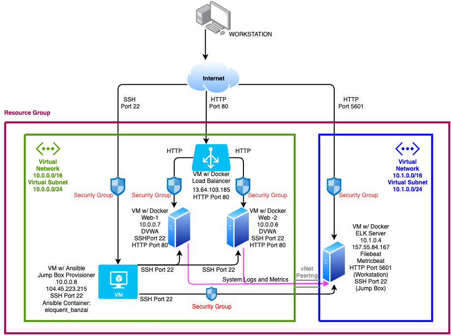

The files in this repository were used to configure the network depicted below.

**Note**: The following image link needs to be updated. Replace `diagram_filename.png` with the name of your diagram image file.  

These files have been tested and used to generate a live ELK deployment on Azure. They can be used to either recreate the entire deployment pictured above. Alternatively, select portions of the playbook file may be used to install only certain pieces of it, such as Filebeat.

  - _Enter the playbook file._
/Users/Matt/ASU_Cyber_Project_1/Ansible/install-elk.yml

This document contains the following details:
- Description of the Topology
- Access Policies
- ELK Configuration
  - Beats in Use
  - Machines Being Monitored
- How to Use the Ansible Build

### Description of the Topology

The main purpose of this network is to expose a load-balanced and monitored instance of DVWA, the D*mn Vulnerable Web Application.

Load balancing ensures that the application will be highly secure, in addition to restricting traffic to the network.
-What aspect of security do load balancers protect? What is the advantage of a jump box?_
    - The Load Balancer protects against Distibuted Denial-Of-Servvice attacks by shifting the the attack traffic
    - The Jump Box is the host device that can be accessed securely from the internet.  Once connected, the user can "jump" around the network(s) and devices to perform administrative tasks.

Integrating an ELK server allows users to easily monitor the vulnerable VMs for changes to the logs and system traffic.
- What does Filebeat watch for?_
    - Filebeat monitors system log files and/or specified locations for changes made to the system, then forward them to the user specified area for indexing
- What does Metricbeat record?_
    - Metricbeat records system metrics and statistics, and ships them to the user specfied location

The configuration details of each machine may be found below.

| VM Name  | Function   | Private IP Address | Public IP Address             | Operating System |
|----------|------------|--------------------|-------------------------------|------------------|
| Jump Box | Gateway    | 10.0.0.8           | 104.45.223.215                | Linux            |
| Web-1    | Web Server | 10.0.0.7           | 13.64.103.185 (Load Balancer) | Linux            |
| Web-2    | Web Server | 10.0.0.6           | 13.64.103.185 (Load Balancer) | Linux            |
| ELK-VM   | ELK Server | 10.1.0.4           | 157.55.84.167                 | Linux            |

### Access Policies

The machines on the internal network are not exposed to the public Internet. 

Only the Jump Box machine can accept connections from the Internet. Access to this machine is only allowed from the following IP addresses:
- Add whitelisted IP addresses_
    - My personal home device Public IP

Machines within the network can only be accessed by the Jump Box via SSH.
- Which machine did you allow to access your ELK VM? What was its IP address?_   
    - The Jump Bov Virtual Machine with a VNet IP of 10.0.0.8

A summary of the access policies in place can be found in the table below.

| Name     | Publicly Accessible | Allowed IP Addresses      |
|----------|---------------------|---------------------------|
| Jump Box | No                  | Home Public IP            |
| Web-1    | No                  | 10.0.0.8                  |
| Web-2    | No                  | 10.0.0.8                  |
| ELK      | No                  | 10.0.0.8 / Home Public IP |

### Elk Configuration

Ansible was used to automate configuration of the ELK machine. No configuration was performed manually, which is advantageous because...
- What is the main advantage of automating configuration with Ansible?
    - The main advantage of Ansible is that it allows the IT administrators to automate daily tasks, allowing them to focus on other important tasks.

The playbook implements the following tasks:
- _In 3-6 bullets, explain the steps of the ELK installation play. E.g., install Docker; download image; etc._
- Install docker.io
- Install python3-pip3
- Install docker module
- Increase virtual memory
- Use more memory
- Download and launch a docker web container

The following screenshot displays the result of running `docker ps` after successfully configuring the ELK instance.

/Users/Matt/ASU_Cyber_Project_1/Diagrams/Docker_PS

### Target Machines & Beats
This ELK server is configured to monitor the following machines:
- Web-1 10.0.0.7
- Web-2 10.0.0.6

We have installed the following Beats on these machines:
- Filebeat
- Metricbeat

These Beats allow us to collect the following information from each machine:
- Filebeat allows up to monitor and rack all of the system log, as well as any specified locations for changes made.
/Users/Matt/ASU_Cyber_Project_1/Diagrams/Filebeat

- Metricbeat monitors data pertaining to system metrics, such as data usage, system usage, and uptime.
/Users/Matt/ASU_Cyber_Project_1/Diagrams/Metricbeat

### Using the Playbook
In order to use the playbook, you will need to have an Ansible control node already configured. Assuming you have such a control node provisioned: 

SSH into the control node and follow the steps below:
- Copy the install-elk.yml file to /etc/ansible.
- Update the hosts file to include the server(s) IP address, including 'ansible_python_interpreter=/usr/bin/python3'
- Run the playbook, and navigate to http://157.55.84.167:5601/app/kibana#/home to ensure the ELK server is running.

